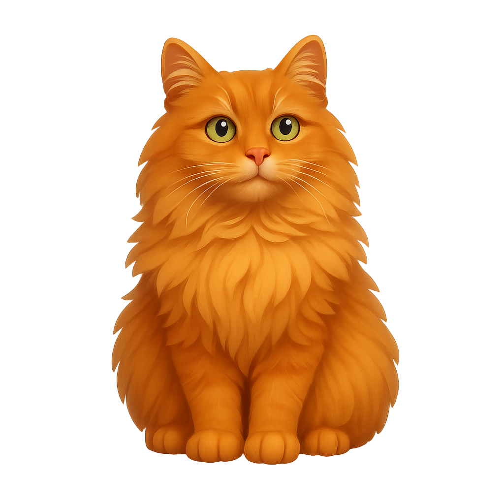

# Bruno's Game Den

**Live:** [expectfun.github.io/brunogames](https://expectfun.github.io/brunogames)

*Warning: this is a vibecoded pet project. It's a free mini game app made mostly for friends, it definitely shouldn't be taken as an example of good code.*

Small standalone HTML games collected in one place, with Bruno the cat as the mascot. The project is inspired by minimal browser games: no build step, no frameworks — just open and play. Right now there are four games, with room to grow over time.

## What this is

This repository is a set of tiny browser games for quick fun, with a deliberately minimal approach.

* No build step is required to run the games.
* Each game is usually a self-contained `.html` file with inline CSS and JavaScript.
* Some games use small supporting assets (images, data files in `assets/`).
* The catalog lives in `index.html`.

The games integrate with Telegram Mini Apps (WebApp API) when opened inside Telegram; they also work in any modern browser.

## Games

### Arcade

* **brumba.html** — Help Bruno ride his Roomba through the house. Tap to jump over chairs or stay low under tables.

### Word

* **brunle.html** — Guess the secret word in 6 tries. A feline twist on the classic word game.

### Quiz

* **brunquiz.html** — Test your movie knowledge with Bruno as your host. How many films can you guess?

### Puzzle

* **brunjeweled.html** — Match 3 or more cats to score points. Features Bruno and his feline friends.

## About

Small standalone HTML games · Bruno the cat 🐱
